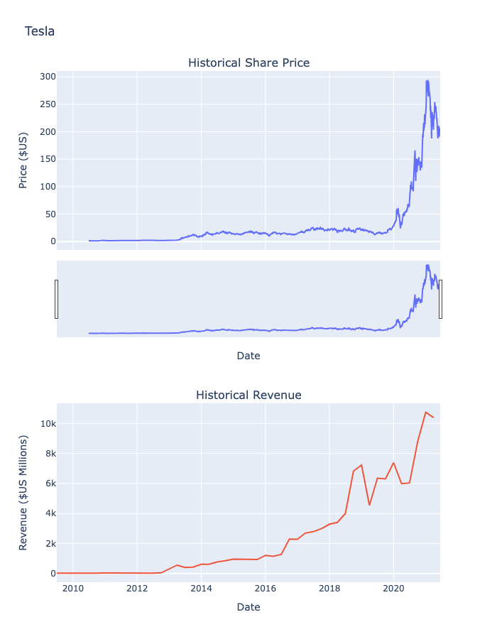
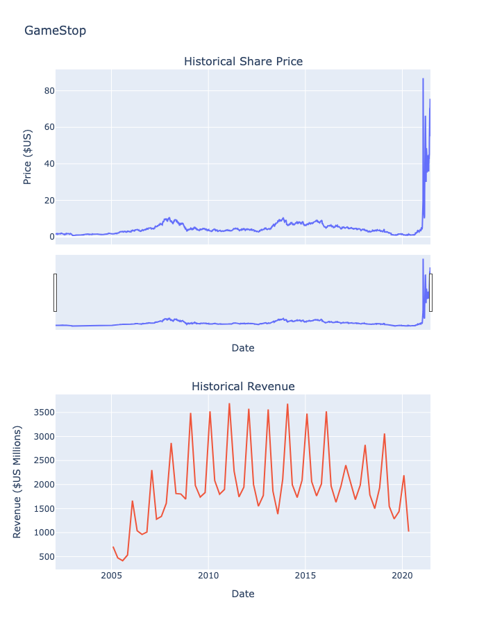

<h1>📊 Analyse des actions Tesla, Amazon, AMD, GameStop</h1>

  
  
  
  
  
  
  

Ce projet fait partie d'un programme d'apprentissage en science des données. Il consiste à extraire des données financières à partir de différentes sources, puis à les analyser et les visualiser dans un tableau de bord interactif.

🔍 Objectif
L’objectif principal est de permettre une prise de décision éclairée grâce à l’analyse visuelle de données boursières. 
- Extraire les cours historiques d’actions populaires (Tesla, Amazon, AMD, GameStop)
- Récupérer des rapports de revenus trimestriels via des bibliothèques Python et du web scraping
- Analyser et visualiser les tendances du marché à l’aide d’un tableau de bord

## 📊 Visualisation des données

---

## 👤 Auteur

- [Kenza Djeddi Ali]

---
